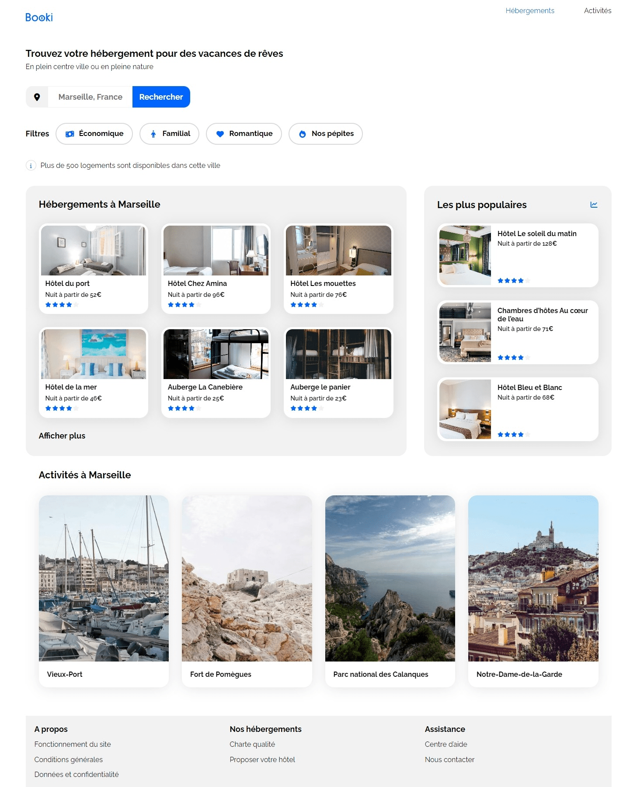
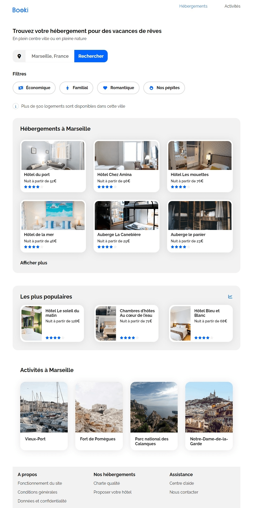
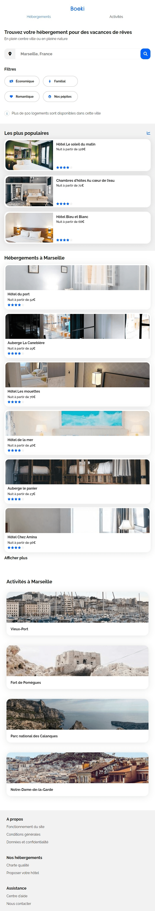

# booki
This project is part of web development training.
The objective is to integrate a mock-up using html and css only.
There are 3 different versions of the site, depending on the size of the device.

## Regular device

## Medium device

## Small device

